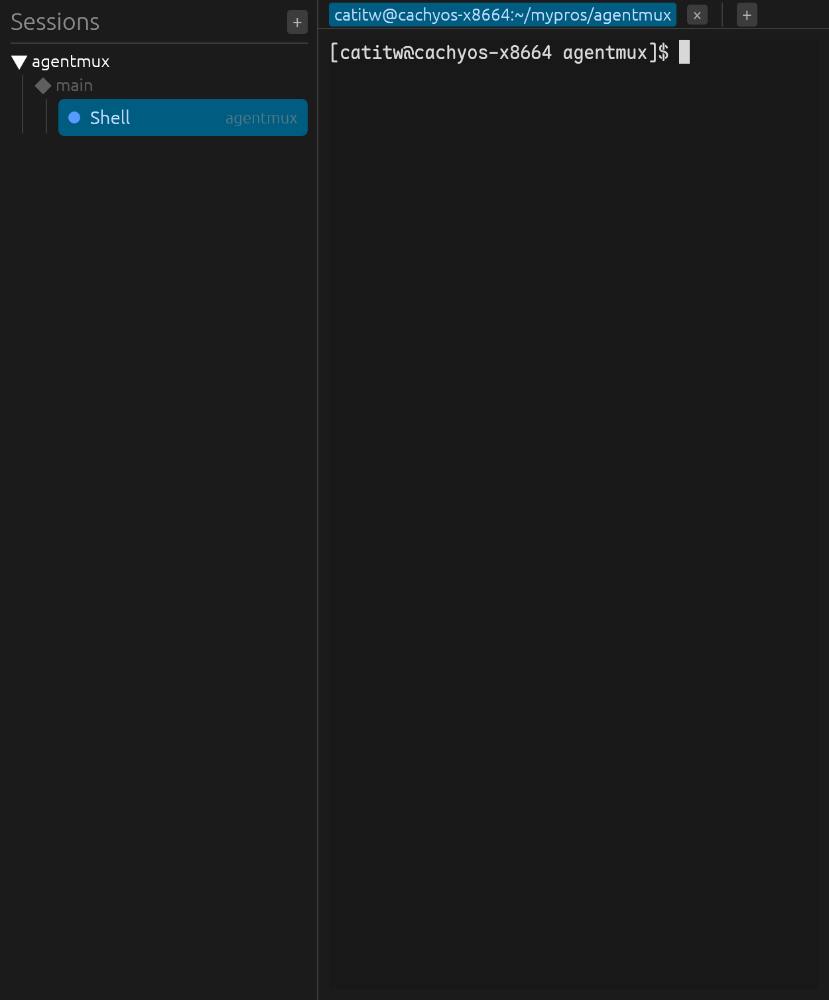

# agentmux

原生跨平台 GUI(Linux / macOS / Windows),在多个 tab 的嵌入式真终端里并行运行多个 hermes 编码 agent(Claude Code、omp、Codex 等),并自动识别当前运行的工具与其状态。灵感来自 [herdr](https://github.com/herdrdev/herdr)(TUI 终端多路复用器);agentmux 是它的原生 GUI 实现,基于 **egui + alacritty_terminal**。



## 特性

- **多 tab 嵌入式终端** — alacritty 终端引擎(alt-screen、滚回、选择、SGR 鼠标),256 色 / 真彩支持;会话自动以 `TERM=xterm-256color` + `COLORTERM=truecolor` 启动。
- **agent 自动识别 + 状态** — 三通道检测:进程扫描(识别哪个工具)、屏幕规则引擎(Working / Idle / Blocked)、hook 权威上报;状态变化通过 toast 通知。
- **hook 集成** — `agentmux --install-hooks` 一键安装 claude / omp 生命周期上报(非破坏合并 + 备份),`--uninstall-hooks` 卸载。
- **Project → Git 分支 → 会话自动分组** — 按会话的工作目录归类(活 cwd 跟踪,`cd` 后即时重分类),项目可折叠。
- **会话持久化** — 会话列表(目录、命令、自定义名)存于 `config_dir()/agentmux/sessions.json`,原子写入,重启自动恢复。
- **ghostty 主题 / 字体对齐** — 终端与界面 chrome 使用与 ghostty 相同的调色板(解析自 `ghostty +show-config`,缺省回退 Catppuccin Mocha);终端字体偏好 Maple Mono NF CN 等。
- **Nerd Font / CJK 兜底** — 系统字体发现 + 内嵌 NerdFontsSymbolsOnly 符号字体,图标、CJK、盲文 spinner 不再显示豆腐块。

## 安装

### 前置

- Rust 工具链。仓库内 `rust-toolchain.toml` 固定 **1.97.1**(MSRV 1.92);在仓库目录内执行 cargo 命令时 rustup 会自动选用该版本。

### 推荐:安装脚本

```bash
git clone git@github.com:catitw/agentmux.git
cd agentmux
./install.sh              # cargo install + 桌面启动器入口
./install.sh --with-hooks # 额外启用 claude / omp 状态上报
```

`install.sh` 依次执行:`cargo install --path . --locked`、安装 freedesktop 桌面启动器入口(应用菜单中出现 agentmux),`--with-hooks` 时再安装 hook 集成。脚本自带 `set -eu`,每步失败都会明确报错。

卸载:

```bash
./uninstall.sh        # 先移除启动器入口,再 cargo uninstall(保留 ~/.config/agentmux 配置)
./uninstall.sh --purge # 同时删除配置目录
```

### 备选:手动 cargo install

```bash
git clone git@github.com:catitw/agentmux.git
cd agentmux
cargo install --path .
```

安装完成后二进制位于 `~/.cargo/bin/agentmux`。hook 脚本与内嵌的 Nerd Font 符号字体均通过 `include_str!` / `include_bytes!` 在编译期内嵌,安装产物自包含,不需要额外的资产文件。

桌面启动器入口也可手动安装:

```bash
agentmux --install-desktop-entry   # 写入 ~/.local/share/applications/agentmux.desktop + 图标
agentmux --uninstall-desktop-entry # 精确移除上述两个文件
```

### 安装后(可选)

```bash
# 启用 claude / omp 的权威状态上报(状态由 agent 自身报告,优先级最高)
agentmux --install-hooks
# 卸载 hook(仅移除 agentmux 的条目,保留用户原有配置;安装时留有带时间戳的备份)
agentmux --uninstall-hooks
```

### 卸载(手动方式)

```bash
cargo uninstall agentmux
```

## 使用

- 启动:`agentmux`。
- **新建会话**:点击任意 `+`(侧栏、标签栏、空状态),立即以当前选中会话的工作目录(无选中时用 `$HOME`)新建一个默认 shell 会话。
- **重命名**:右键会话行 → "Rename session",行内编辑,Enter 提交、Esc 取消、留空提交清除自定义名。
- **状态点**:检测到 agent 时按 agent 状态着色(Working 蓝 / Idle 灰 / Blocked 橙);无 agent 时按进程状态着色(Running 蓝 / Done 绿 / Error 红)。⚡ 标记表示状态来自 hook 权威通道。
- **分组折叠**:点击项目标题(▼/▶)折叠该项目的会话树。

## 平台支持

- **Linux**(X11 / Wayland)、**macOS**、**Windows**(ConPTY)。
- 桌面启动器入口是 freedesktop 标准(Linux/BSD);macOS/Windows 的开始菜单 / 应用包集成是未来工作。
- 已知限制:
  - Windows 上 claude hook 资产为 POSIX sh 脚本,无法执行(需未来的 .ps1 变体);omp 扩展已支持 Windows 路径,因此 omp 会话在 Windows 上仍有 hook 上报。
  - 活 cwd 跟踪在 Linux(/proc)与 macOS(libproc)上可用;Windows 无此 API,分组回退使用会话启动时的工作目录。

## 文档

- [docs/phase2-detection.md](docs/phase2-detection.md) — agent 检测引擎(进程扫描、屏幕规则、校准)
- [docs/phase3-hooks.md](docs/phase3-hooks.md) — hook 集成(协议、仲裁、安装行为)
- [docs/phase4-persistence.md](docs/phase4-persistence.md) — 会话持久化与新建/重命名流程
- [docs/phase5-grouping.md](docs/phase5-grouping.md) — Project → 分支 → 会话分组
- [docs/terminal-theme.md](docs/terminal-theme.md) — ghostty 主题与字体对齐
- [docs/fonts.md](docs/fonts.md) — 字体兜底链与内嵌符号字体
- [docs/ui-design.md](docs/ui-design.md) — UI 设计(调色板派生、单一强调色)
- [docs/research/](docs/research/) — 前期调研(herdr 架构、GUI 框架评估、检测可行性)

## 开发

```bash
cargo build            # 构建
cargo test             # 测试
cargo clippy --all-targets  # Lint(需零警告)
```
