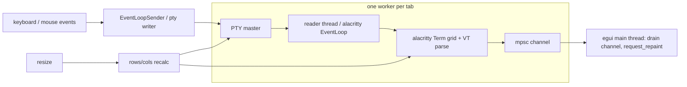

# GUI Framework Evaluation for agentmux

**Date:** 2026-08-05 · **Scope:** read-only research for a new Rust desktop app (`agentmux`, currently an empty library crate, edition 2024, no dependencies). All version/date/download facts below were pulled from the crates.io API and the linked repos/docs on this date; nothing is inferred where a citation is given.

---

## 1. Executive summary

**Recommendation: egui / eframe (v0.35) + `alacritty_terminal` (v0.26) as the terminal core, with a small custom (or vendored `egui_term`) terminal widget, `portable-pty` (v0.9) for PTY ownership, and egui panels for the sidebar + tab layout.**

Rationale in one paragraph: agentmux's hardest requirement — embedding real, interactive, full-screen TUI agents (Claude Code) in multiple tabs — is *solved in production* on this exact stack: **Horizon** (`peters/horizon`, MIT, released binaries for Linux/macOS/Windows) is a GPU-accelerated multi-terminal "terminal board" built with eframe + `alacritty_terminal` and documents its whole threading model; `nxshell` (SSH session manager) and `magic-mesh`'s `mde-term-egui` are further egui terminal apps; and the dedicated widget crate **`egui_term`** (kemokempo) has been bumped to egui 0.35 + `alacritty_terminal` 0.26 on its master branch, including a ready-made **multi-tab example**, tested on macOS/Linux/Windows. egui satisfies "native" (winit native window, GPU rendering, no webview), the sidebar + tabs layout is trivial-to-moderate, and — decisive for *this* team — the dev environment already ships egui apps (`ly-device-client`, `ly-device-mock`) and maintains egui-specific skills (egui_plot, egui/wgpu 3D viewport, egui e2e driving on this Hyprland/XWayland box), so iteration and verification will be fastest on egui.

**Runner-up: iced (v0.14) + `iced_term` (v0.8).** `iced_term` is the single most turnkey terminal widget of any framework surveyed (stock iced 0.14 + `alacritty_terminal` 0.25.1, multi-instance, tested on all three OSes, repo active as of 2026-08-01), and System76's COSMIC Terminal proves the paradigm in a shipping product. Choose iced only if the team prefers an Elm architecture and accepts pre-1.0 API churn (iced is 0.x; `iced_term` itself declares its API unstable until iced 1.0).

**Rejected:**
- **Tauri 2** — has the *easiest* terminal path (xterm.js 5.3.0, the renderer VS Code ships, plus an active `tauri-plugin-pty`), but it renders UI as HTML/CSS in a system webview (WebView2 / WKWebView / WebKitGTK). That fails the explicit "NATIVE GUI" requirement, and this dev machine has documented Tauri/WebKitGTK blank-window failures (see the `diagnose-webkitgtk-blank-window` / `diagnose-tauri-webkit-transparent-window` skills, e.g. the Buzz app).
- **Slint (1.17)** — no terminal widget or PTY integration exists anywhere in its ecosystem; the only rendering paths are a CPU-rasterized pixel buffer stuffed into `slint::Image` or a custom GL texture (maintainer's own guidance). Worse, Slint 1.16 made Fluent the default style and is *deprecating native-looking styles* — the opposite direction from this requirement.
- **Dioxus (0.7)** — desktop is the same wry/tao system-webview stack as Tauri (so not native), with *no* off-the-shelf PTY/terminal plugin (unlike Tauri), and its native renderer (`dioxus-native`) is still 0.8.0-alpha. It combines Tauri's native-ness problem with more terminal work.

**The hardest risk — embedding real interactive terminals — is explicitly addressed in §6.** The recommended stack does not use a toy VT parser: `alacritty_terminal` is the exact emulator core Alacritty ships (alt-screen, bracketed paste, SGR mouse, truecolor, ConPTY on Windows), the same core COSMIC Terminal uses.

---

## 2. Fixed requirements (recap)

1. Native cross-platform GUI (Linux/macOS/Windows) — explicitly NOT a TUI, contrasted against an existing TUI tool.
2. Left sidebar: work directories + a "hermes tool" name per entry (selectable list).
3. Right pane: multi-tab terminal pages, each an **actual interactive terminal** running a full-screen TUI agent (Claude Code) → real PTY + terminal emulation, one process per tab.
4. Per-tool status (idle/running/done/error) detected from the terminal session.
5. Reasonable maturity + active maintenance on crates.io.

---

## 3. Candidate comparison at a glance

Facts as of 2026-08-05 (crates.io API).

| | **egui/eframe** ✅ | **iced** | **Tauri 2** | **Slint** | **Dioxus** |
|---|---|---|---|---|---|
| Latest version | egui 0.35.0 / eframe 0.35.0 (2026-06-25) | 0.14.0 (2025-12-07) | 2.11.5 (2026-07-01) | 1.17.1 (2026-07-07) | 0.7.10 stable; 0.8.0-alpha.1 (2026-07-31) |
| Downloads (all-time) | egui 20.9M / eframe 16.1M | 2.45M | 24.4M | 1.42M | 2.17M |
| Native widgets (no webview) | ✅ winit + GPU | ✅ winit + GPU | ❌ system webview | ✅ winit + GPU (own styles) | ❌ system webview (wry) |
| Terminal widget exists | ✅ `egui_term` (git master = egui 0.35); custom-widget precedents (horizon, nxshell, magic-mesh) | ✅ `iced_term` 0.8.0 (iced 0.14) — most turnkey | ✅ xterm.js 5.3.0 + `tauri-plugin-pty` 0.3.1 | ❌ none; custom renderer needed | ⚠️ xterm.js possible, no plugin; hand-rolled IPC |
| PTY / Windows ConPTY | ✅ `alacritty_terminal::tty` or `portable-pty` 0.9 | ✅ `alacritty_terminal` backend (tested Win) | ✅ `portable-pty` 0.9 via plugin (spawns `powershell.exe` in example) | ⚠️ possible via `portable-pty`, rendering gap remains | ⚠️ possible via `portable-pty`, IPC to bridge |
| Sidebar + tabs effort | trivial–moderate (SidePanel + ~30-line tab strip; no built-in tab widget, issue #1624) | moderate (`iced_aw::Tabs` exists) | trivial (HTML/CSS) | trivial (.slint) | trivial (HTML/CSS) |
| Team/environment fit | **excellent** (egui skills + egui apps in this dev setup) | none | poor (WebKitGTK failures documented on this machine) | none | none |
| Main blocker for agentmux | crates.io `egui_term` release stale (0.1.0) → use git dep or vendor (small) | iced pre-1.0 churn; widget API unstable | not native; WebKitGTK dependency + this machine's blank-window history | no terminal story; native styles deprecated | not native; no terminal tooling |

---

## 4. Per-framework analysis

### 4.1 egui / eframe — RECOMMENDED

**1. Interactive terminal embedding.** Yes, two concrete options:

- **`egui_term`** (kemokempo/Harzu, 72★, repo touched 2026-07-30, not archived): "Terminal emulator widget powered by EGUI framework and alacritty terminal backend." Master `Cargo.toml` pins **egui/eframe 0.35, `alacritty_terminal` 0.26, wgpu 29** (rust-version 1.92) — i.e. current with today's egui. Features: PTY content rendering, **multiple instances**, keyboard/mouse input + custom bindings, resize, scroll, focus, selection, fonts/color schemes, hyperlinks; tested on macOS, Linux, Windows. It ships a **`tabs` example** ("example with tab widget that show how multiple instance feature work") — the exact multi-tab pattern agentmux needs.
  - ⚠️ The crates.io release (v0.1.0, 2025-04-24, only ~1.9k downloads) predates the master bump. Mitigations: depend on the git repo, or vendor the crate (it is small — a widget + examples, no heavyweight deps beyond egui + `alacritty_terminal`).
- **Production precedents for a custom widget (plan B):** **Horizon** (`peters/horizon`) — "GPU-accelerated terminal board — a visual workspace for managing multiple terminal sessions as freely positioned, resizable panels"; stack: **eframe/egui (wgpu) 0.33 + `alacritty_terminal` 0.26**, edition 2024, MIT, released binaries for Linux/macOS/Windows. Its documented threading model (§6) is a directly reusable architecture. Also: **nxshell** (`iamazy/nxshell`, cross-platform SSH session manager with embedded terminals) and **magic-mesh**'s `mde-term-egui` (alacritty-core VT engine with scrollback, split panes + tabs, SGR/1006 mouse, truecolor; changelog active 2026-07).

**2. Sidebar + multi-tab layout.** Trivial-to-moderate. egui is immediate-mode: `egui::SidePanel::left(...)` for the work-directory sidebar (a `SelectableLabel` list with a status dot per row), `egui::CentralPanel` for the terminal area. egui has **no built-in tab widget** (emilk/egui issue #1624; the `egui_tabs` crate is stale at 0.2.1/2024 and `egui_dock` targets docking), but a tab strip is ~30 lines (`ui.selectable_label` over a `Vec<TabId>`), and `egui_term`'s tabs example demonstrates exactly this. Note egui immediate mode repaints on interaction/events by default — perfect for PTY-driven updates (just call `ctx.request_repaint()` when terminal events arrive).

**3. Cross-platform PTY.** Two proven routes: (a) `alacritty_terminal::tty` + its `EventLoop` (what Horizon does; the same tty layer Alacritty ships on Windows via ConPTY), or (b) `portable-pty` 0.9 (wezterm's crate, 10.2M downloads, `native_pty_system()` → ConPTY on Windows; docs.rs lists `Child`/`ExitStatus` — useful for status detection, §5). Both work on Linux (pty/forkpty), macOS, Windows.

**4. Maturity.** egui 0.35.0 / eframe 0.35.0 released 2026-06-25; 20.9M / 16.1M all-time downloads; ~monthly breaking releases (0.33.3 → 0.34.1 → 0.35.0 within a year) — active but pin versions. eframe 0.35 runs on the wgpu backend (Vulkan/Metal/DX12), works on Wayland + X11 (this machine is Hyprland). Ecosystem is the largest of the native-rendered Rust GUI families. Caveat: egui breaks API every few releases; pinning one minor version and updating deliberately is the norm.

**5. Environment fit.** This dev setup already uses egui heavily: installed skills include egui_plot time-axis/drag-pause recipes, egui-wgpu 3D viewport embedding, egui DragValue/winit input driving over XTest, and e2e drive/screenshot recipes for the egui client `ly-device-client` (egui/winit) on this machine's rootless-XWayland Hyprland session; `ly-device-mock` is an egui app too. Reusing that knowledge (rendering, input quirks, verification harness) directly de-risks agentmux. No other framework has any skill or prior app in this setup.

### 4.2 iced — strong runner-up

**1. Interactive terminal embedding.** **`iced_term` 0.8.0** (kemokempo, 174★, repo updated 2026-08-01 — the most actively maintained terminal widget surveyed): "Terminal emulator widget powered by ICED framework and alacritty terminal backend." Cargo.toml: **iced 0.14.0, `alacritty_terminal` 0.25.1, tokio**, `iced_core`/`iced_graphics` 0.14. Feature list: PTY content rendering, **multiple instance support** (each `Terminal::new(term_id, settings)` is a separate PTY), keyboard input, mouse interaction in different modes, custom bindings, resizing, scrolling, focusing, selection, fonts/colors, hyperlinks; tested macOS/Linux/Windows. It spawns its own shell via `BackendSettings { shell }` and exposes a `subscription()` for backend events — a clean multi-tab model (one `Terminal` per tab, distinct ids).
- Production proof of the paradigm: **cosmic-term 1.5.0** (pop-os/cosmic-term, 584★, active 2026-08-02) — System76's COSMIC Terminal shipping with Pop!_OS — is an iced-family app on `alacritty_terminal` 0.25.1 + tokio + cosmic-text. ⚠️ Honest caveat: cosmic-term runs on **libcosmic**, System76's forked/patched iced, not stock iced — so the only stock-iced production-grade terminal widget is `iced_term` itself.

**2. Sidebar + multi-tab layout.** Moderate. Iced is retained/Elm: sidebar = a `Row`/`Container` with a `pick_list`-or-`button` list; tabs via the community `iced_aw` "additional widgets" crate (feature-gated `Tabs` widget), or hand-rolled. State per tab (PTY handle, grid, status) lives in the app model; the Elm `Message`/`update` loop is fine for this, but every terminal event becomes a message — throughput is fine for terminal-scale traffic (cosmic-term does it).

**3. Cross-platform PTY.** Same as egui: `alacritty_terminal` backend with ConPTY on Windows; `iced_term` is explicitly tested on Windows.

**4. Maturity.** iced 0.14.0 (2025-12-07; "reactive rendering, time-travel debugging, headless testing" headline features), 2.45M downloads, very active (iced-rs/iced). ⚠️ iced is pre-1.0 with breaking releases (0.13 → 0.14 was a big churn); `iced_term`'s README states its API is unstable and "under development" until iced 1.0. If the app pins iced 0.14 + iced_term 0.8 and stays put, this is manageable; if the team wants to track iced releases, expect migration work.

**5. Environment fit.** None: no iced skills, no iced apps in this dev setup. The Elm architecture is a paradigm change from the team's egui experience.

### 4.3 Tauri 2 — best terminal, but fails the "native" requirement

**1. Interactive terminal embedding.** The strongest terminal rendering available anywhere in this survey: **xterm.js 5.3.0** (npm latest) — the terminal renderer VS Code ships — plus an active PTY bridge plugin: **`tauri-plugin-pty` 0.3.1** (updated 2026-07-08, ~41.8k downloads; README: "A Tauri2 plugin for embedding a terminal in your application"; built on **portable-pty 0.9**; API: `spawn(...)` → `pty.onData(data => term.write(data))`, `term.onData(data => pty.write(data))`; its example spawns `powershell.exe` — i.e. Windows/ConPTY is exercised). Layout is HTML/CSS → sidebar/tabs are trivial.

**2–3.** PTY story is fully solved cross-platform via portable-pty (ConPTY on Windows, forkpty on Unix) and node-pty-style flows are battle-tested in the Electron world (Obsidian terminal plugins etc.).

**4. Maturity.** Tauri 2.11.5 (2026-07-01), 24.4M downloads, big ecosystem. ⚠️ The plugin README still says "Developing! Welcome to contribute!" — usable but young; API churn across plugin 0.x versions has been reported by users.

**5. Is it "native enough"?** Honest answer: **no for this user.** Tauri renders the whole UI as HTML/CSS/JS inside the OS's system webview — WebView2 on Windows, WKWebView on macOS, WebKitGTK on Linux — with native window chrome only; wry hard-selects the platform webview with no opt-out. The user explicitly demands a NATIVE GUI in contrast to a TUI tool; a webview UI is a different class of compromise. Additional environment-specific blocker: this machine has a documented history of Tauri/WebKitGTK apps (Buzz) rendering blank/transparent windows — there are dedicated diagnostic skills for it in this dev setup — and Linux carries a heavy WebKitGTK system dependency. If the requirement were relaxed ("native shell, web UI acceptable"), Tauri would jump to the top because of xterm.js; as specified, it is out.

### 4.4 Slint — no terminal story, and moving away from native looks

**1. Interactive terminal embedding.** **None exists.** No terminal widget, no PTY integration example, nothing in the ecosystem. The maintainers' own answer for custom drawing (slint-ui/slint discussion #1080) is to rasterize a pixel buffer in Rust and display it via `slint::Image`; the alternative is a custom GL texture through renderer APIs (issue #977, #704). Either way you are building the entire terminal pipeline yourself — grid, VT parsing glue, glyph rasterization, IME, mouse reporting, selection, scrollback — with no precedent to copy. This is the highest-effort path of all five by a wide margin.

**2.** The .slint declarative language makes sidebar + tabs easy; the terminal pane is the problem, not the chrome.

**3.** PTY itself would work (`portable-pty` is framework-agnostic), but rendering the output remains greenfield.

**4. Maturity.** Slint 1.17.1 (2026-07-07; 1.17 added drag-and-drop, system tray, tooltips), 1.42M downloads, very active company-backed project. ⚠️ Directional conflict: **Slint 1.16 made "Fluent" the default style on all platforms and announced deprecation of native-looking styles** (slint.dev blog "Changing the Default Style in Slint — Deprecating Native-Looking Styles", 2026-03-31; discussion #11206). A user asking for a native GUI would find Slint's own roadmap heading the other way.

**5. Environment fit.** None.

### 4.5 Dioxus — webview like Tauri, with less terminal tooling

**1. Interactive terminal embedding.** Dioxus desktop (stable 0.7.10, 2026-07-30) renders through **wry/tao system webviews** (docs: "Dioxus desktop is built on top of wry… In the future, we plan to move to a custom web renderer"). So xterm.js is *possible* in the webview — but unlike Tauri there is **no off-the-shelf PTY plugin**: you would hand-roll the IPC bridge (Rust `portable-pty` side + JS xterm side + events), and there is no community equivalent of `tauri-plugin-pty` to copy. The future native renderer (`dioxus-native`) is 0.8.0-alpha.1 (2026-07-31) — not production.

**2.** HTML/CSS → sidebar/tabs trivial.

**3.** Same webview caveat as Tauri: not native widgets. **4. Maturity.** 0.7 line stable since 2025-10, but 0.8.0-alpha churn is ongoing; smaller desktop ecosystem than Tauri; frequent breaking releases. **5. Environment fit.** None.

---

## 5. Recommended concrete stack

```toml
# agentmux (edition 2024) — pinned as of 2026-08-05
eframe = { version = "0.35", default-features = false, features = ["default_fonts", "wgpu", "x11", "wayland"] }
egui = "0.35"
alacritty_terminal = "0.26"   # terminal core: VT parsing, grid, alt-screen, mouse, tty (ConPTY on Windows)
portable-pty = "0.9"          # PTY ownership + child-exit status (wezterm; ConPTY on Windows)
# terminal widget: egui_term from git (master is on egui 0.35) OR a vendored/adapted copy
egui_term = { git = "https://github.com/kemokempo/egui_term", branch = "main" }
tokio = { version = "1", features = ["rt", "sync"] }   # optional; alacritty EventLoop already threads PTY reads
```

- **Layout:** `egui::SidePanel::left` = work-directory list (dir + hermes tool name + status dot: idle/running/done/error); `egui::CentralPanel` = tab strip (`selectable_label` over `Vec<TabId>`, pattern from `egui_term/examples/tabs`) + one terminal widget per active tab. Immediate mode handles per-tab visibility naturally; keep non-visible tabs' `Term` alive and skip painting.
- **Terminal widget:** start from `egui_term` (git); if we prefer zero third-party widget code, re-implement its ~rendering half following **Horizon's** `terminal_widget/` (layout/input/render/scrollbar) — a known-good ~2–3k LOC pattern.
- **PTY + emulation ownership:** option A (Horizon-proven): per-tab `alacritty_terminal::tty` + `EventLoop` thread feeding a channel. Option B (recommended for status detection): `portable-pty` owns the master/slave, a reader thread feeds raw bytes both into a `Term::process_bytes`-style parser and into a status tap (§ status detection), and `Child` exit codes are observed via `try_wait`.

### Threading model (Horizon-proven, from its AGENTS.md)



### Status detection (requirement 4) — layered, terminal-native

1. **Process layer (authoritative):** PTY child exit — `portable-pty::Child::try_wait()` / exit event → `done` (exit 0) vs `error` (exit ≠ 0, or killed). Detect "running" as child-alive.
2. **Stream layer (idle vs running, "detected from the terminal session"):** tap the raw PTY byte stream in front of the VT parser and scan for **OSC 133 shell-integration markers** (FinalTerm protocol: `OSC 133;A` = prompt shown → idle; `OSC 133;C` = command started → running; `OSC 133;D` = command finished + exit code → done/error). This works for any shell/agent that emits the markers; install the integration hook when provisioning the tool. No marker support → fall back to prompt-heuristic on the captured scrollback (e.g. trailing line matching `$ ` / agent banner) and OSC 0 title changes.
3. **Optional strong signal:** Claude Code supports machine-readable output (`--output-format stream-json`) — as a *side channel* (separate pipe) it gives authoritative state transitions without touching the TUI PTY. Use only if the OSC-133 layer proves insufficient; requirement says detect from the terminal session, and OSC 133 is the terminal-native way.
4. Each tab's status derives from combining (1)+(2): `idle` = child alive + prompt marker seen; `running` = child alive + command-start marker (or no prompt marker yet); `done`/`error` = child exited with 0 / non-zero.

### Hardest-risk note: full-screen TUI agents inside the widget

Claude Code-style agents exercise the full terminal feature surface: alternate screen, SIGWINCH-driven resize, bracketed paste, SGR 1006 mouse, truecolor, fast redraw. `alacritty_terminal` 0.26 implements all of it (it *is* Alacritty's engine; COSMIC Terminal and Horizon ship it in production), so the risk moves from "can we emulate a terminal" to "can we render the grid fast enough in egui" — and Horizon/magic-mesh already do per-cell batched text/rect rendering in egui at terminal frame rates. Mouse reporting and key translation exist in both `egui_term` and Horizon's input module — reuse, don't reinvent.

---

## 6. Sources (all accessed 2026-08-05)

**Versions (crates.io API):** egui 0.35.0 / eframe 0.35.0 (2026-06-25) · iced 0.14.0 (2025-12-07) · slint 1.17.1 (2026-07-07) · tauri 2.11.5 (2026-07-01) · dioxus 0.7.10 stable / 0.8.0-alpha.1 (2026-07-31) · dioxus-desktop 0.8.0-alpha.1 · alacritty_terminal 0.26.0 (2026-04-06) · portable-pty 0.9.0 · vte 0.15.0 · egui_term 0.1.0 (2025-04-24) · iced_term 0.8.0 (2026-03-27) · tauri-plugin-pty 0.3.1 (2026-07-08) · egui_tabs 0.2.1 · xterm.js 5.3.0 (npm).

**Repos/docs:**
- egui_term: https://github.com/kemokempo/egui_term (README; master Cargo.toml: egui/eframe 0.35, alacritty_terminal 0.26, wgpu 29; tabs example) · crates.io release: https://crates.io/crates/egui_term
- iced_term: https://github.com/kemokempo/iced_term (README: API model, unstable-warning; Cargo.toml: iced 0.14.0, alacritty_terminal 0.25.1, tokio) · https://crates.io/crates/iced_term
- cosmic-term: https://github.com/pop-os/cosmic-term (Cargo.toml: v1.5.0, alacritty_terminal 0.25.1, libcosmic)
- Horizon: https://github.com/peters/horizon (AGENTS.md: stack eframe/egui wgpu + alacritty_terminal 0.26; threading model; release binaries for 3 OSes; Cargo.toml: eframe/egui 0.33.3, alacritty_terminal 0.26.0, wgpu 27)
- tauri-plugin-pty: https://github.com/Tnze/tauri-plugin-pty (README: xterm.js + portable-pty 0.9, powershell.exe example, "Developing!")
- portable-pty: https://docs.rs/portable-pty/latest/portable_pty/ (wezterm, `native_pty_system`, `Child`/`ExitStatus`) · repo: https://github.com/wezterm/wezterm
- egui tabs gap: https://github.com/emilk/egui/issues/1624 · egui releases: https://github.com/emilk/egui/releases
- iced: https://github.com/iced-rs/iced (0.14 release notes) · iced_aw: https://github.com/iced-rs/iced_aw
- Slint: https://slint.dev/blog/slint-1.16-released and https://slint.dev/blog/default-native-style-change (Fluent default, native styles deprecated) · https://github.com/slint-ui/slint/discussions/1080 (canvas → `slint::Image`) · CHANGELOG (1.17.1)
- Dioxus desktop (wry): https://dioxuslabs.com/learn/0.7/guides/platforms/desktop/ · https://lib.rs/crates/dioxus-native
- Tauri webview platforms: https://v2.tauri.app (WebView2/WKWebView/WebKitGTK); corroborated by https://hackernoon.com/six-months-with-tauri-the-benefits-and-the-bill and https://github.com/p10ns11y/collab-finder/blob/main/docs/tauri-webview-and-devtools.md (wry hard-selects platform webview)
- magic-mesh `mde-term-egui`: https://github.com/matthewmackes/magic-mesh (CHANGELOG, active 2026-07)
- nxshell: https://github.com/iamazy/nxshell (egui SSH session manager)

**Environment evidence (this dev setup):** installed skills `egui-plot-time-axis-drag-pause`, `egui-plot-realtime-trend`, `egui-wgpu-3d-viewport`, `xwayland-egui-dragvalue-input`, `ly-device-client-e2e-drive`, `ly-mock-gui-smoke-3d-drag` (egui/winit apps + e2e recipes); `diagnose-webkitgtk-blank-window`, `diagnose-tauri-webkit-transparent-window` (documented Tauri/WebKitGTK rendering failures on this machine, e.g. Buzz).
